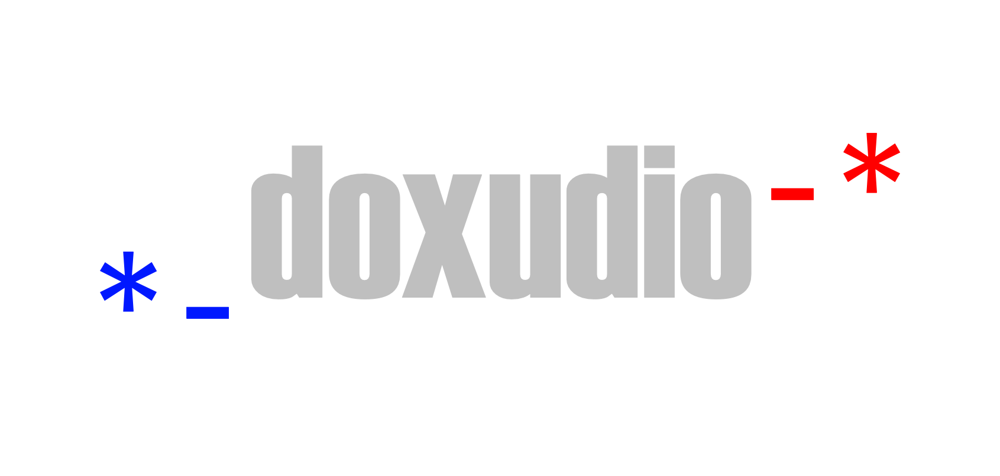

<figure>
    
    <figcaption>This is the doxudio logo with text.</figcaption>
</figure>
# doxudio is a liteweight ebook/audiobook platform.

## Key Features:
* PDF/Epub file viwer
* PDF-Epub convertor
* PDF tools to isolate a chapter for goal binding
* peer-to-peer file sharing
* Book(File) review system
* Centralized database option to make a book public
* File sharing via websockets through odin(server)
* Audiobook option
* Persistent notes option
* API calls for information on any book that is not available
* Dual database system, local for personal features and global for server features
* Related Books using graph theory

